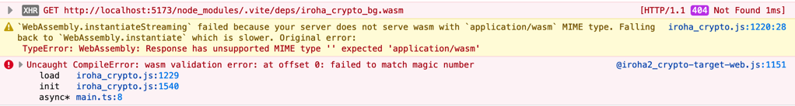

# `hyperledger/iroha-javascript#104` repro

The issue:
[`@iroha2/crypto-target-web` doesn't work with Vite out of the box · Issue #104 · hyperledger/iroha-javascript](https://github.com/hyperledger/iroha-javascript/issues/104)

## Steps to reproduce

1. Install packages:
    ```bash
    $ pnpm i
    ```
2. Run dev server:
    ```bash
    $ pnpm dev
    ```
3. Open browser at printed URL

### Expected result

To see `Sample hash: <long hash>` in the browser.

**Note:** edit `src/main.ts` file

### Actual result

Nothing is displayed in browser, except errors in console:



### Workaround in action

Open `src/main.ts` and change this: 

```ts
// This works:
// import wasmURL from '@iroha2/crypto-target-web/wasm-pkg/iroha_crypto_bg.wasm?url'
// await init(wasmURL)

// This not:
await init()
```

to this:


```ts
// This works:
import wasmURL from '@iroha2/crypto-target-web/wasm-pkg/iroha_crypto_bg.wasm?url'
await init(wasmURL)

// This not:
// await init()
```
